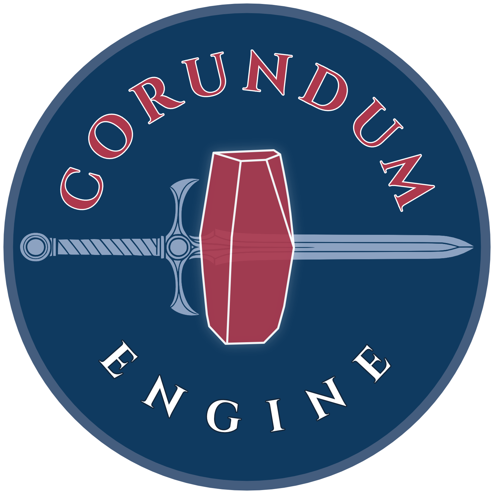

# Corundum Engine

[](https://isocpp.org/)
[](https://en.wikipedia.org/wiki/C%2B%2B23)

<p align="center">
  <a href="https://corundumengine.com">
    
  </a>
</p>

Forging tools for 2D RPGs. A data-oriented engine, editor toolset, and asset pipeline in C++23. **Pre-alpha — under active development, expect breakage.**

## Build

```sh
cmake --preset debug && cmake --build --preset build       # configure + build (debug)
cmake --build --preset release                             # optimised build → build-release/
cmake --build --preset relwithdebinfo                      # optimised + debug symbols
cmake --build --preset debug-sanitized                     # ASan + UBSan → build-sanitized/
cmake --build --preset format                              # clang-format all sources
cmake --build --preset tidy                                # clang-tidy all sources
cmake --preset docs && cmake --build --preset docs         # Doxygen API docs → build/docs/html
ctest --preset test                                        # run all tests
build/tests/corundum_tests -tc="*name*"                    # run a single test
```

### Toolchain

The compiler is pinned to **Homebrew LLVM** (`brew install llvm`) via `cmake/llvm-clang.cmake`. Resolution order: explicit `LLVM_PREFIX` cache variable → `$LLVM_PREFIX` env var → `/opt/homebrew/opt/llvm` (Apple Silicon) → `/usr/local/opt/llvm` (Intel Mac) → PATH fallback. `clang-format` and `clang-tidy` are resolved with `find_program` using `HINTS ${LLVM_PREFIX}/bin`, so the format/tidy presets work without manually exporting PATH. Override the prefix with `cmake -DLLVM_PREFIX=/path/to/llvm ...`.

Requires CMake 4.3+ and a C++23 compiler. Dependencies (nlohmann/json, ImGui, GLFW, sokol, stb, FreeType, doctest) are fetched automatically via FetchContent.

## Run

```sh
build/tools/tilesmith      # Tilemap editor
build/tools/spritesmith    # Sprite sheet editor
build/tools/loom           # Content editor (dialogue, quests, items)
```

## Test

```sh
ctest --preset test                       # all tests
build/tests/corundum_tests -tc="*name*"   # single test
```

## Components

| Directory                    | Purpose                                             |
| ---------------------------- | --------------------------------------------------- |
| `engine/`                    | Pure C++23 core library                             |
| `engine/src/platform/glfw/`  | GLFW windowing and sokol_gfx renderer               |
| `engine/src/platform/sokol/` | sokol_gfx + sokol_audio implementation units        |
| `engine/src/platform/null/`  | No-op stubs for headless testing                    |
| `tools/`                     | Developer tools (Tilesmith, Spritesmith, Loom) |
| `tests/`                     | Unit tests (doctest)                                |

## Dependencies

| Library                                           | Purpose                     |
| ------------------------------------------------- | --------------------------- |
| [nlohmann/json](https://github.com/nlohmann/json) | JSON parsing                |
| [ImGui](https://github.com/ocornut/imgui)         | Editor GUI                  |
| [GLFW](https://github.com/glfw/glfw)              | Windowing and input         |
| [sokol](https://github.com/floooh/sokol)          | GPU rendering, audio        |
| [stb](https://github.com/nothings/stb)            | Image loading, OGG decoding |
| [FreeType](https://freetype.org)                  | Font rasterization          |

## License

Apache-2.0 — see [LICENSE](LICENSE) for details.
