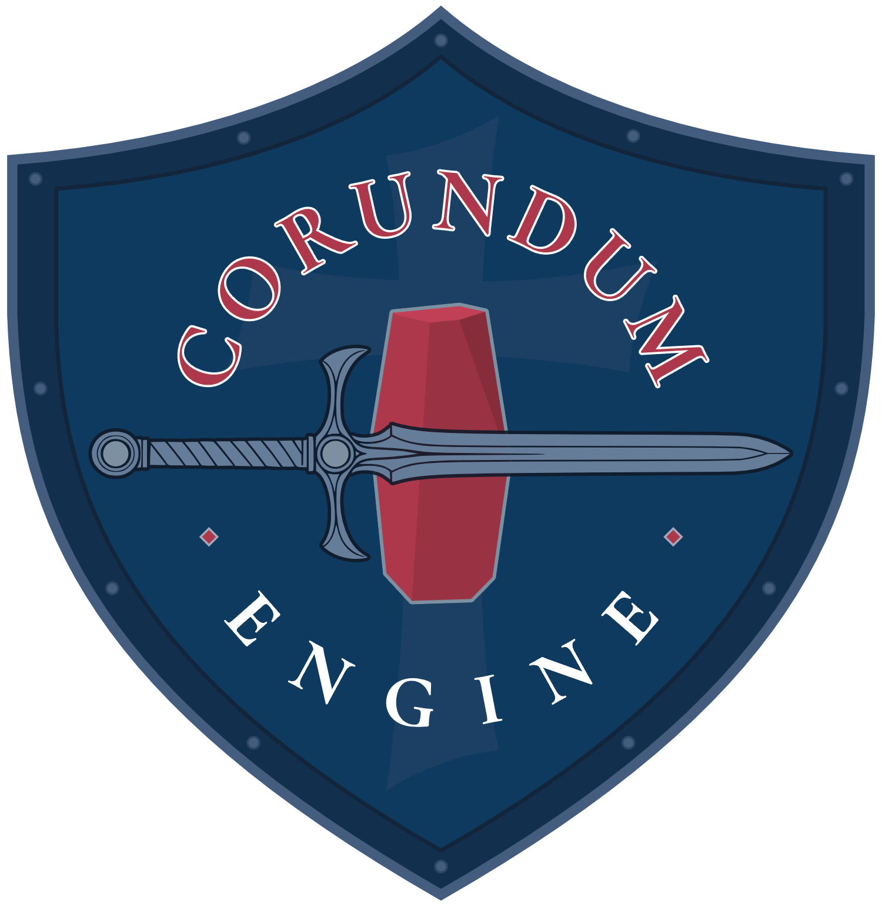

# Corundum Engine

[](https://isocpp.org/)
[](https://en.wikipedia.org/wiki/C%2B%2B23)

<p align="center">
  <a href="https://corundumengine.com">
    
  </a>
</p>

"Corundum Engine" and its logo are trademarks of Gentle Lion Studios, Inc. — see [TRADEMARKS.md](TRADEMARKS.md).

Forging tools for 2D RPGs. A data-oriented engine and editor toolset in C++23. **Pre-alpha — under active development, expect breakage.**

Follow development on [the devlog](https://corundumengine.com/blog/).

## Build

```sh
cmake --preset debug && cmake --build --preset build       # configure + build (debug)
cmake --build --preset release                             # optimised build → build-release/
cmake --build --preset debug-sanitized                     # ASan + UBSan → build-sanitized/
cmake --build --preset format                              # clang-format all sources
scripts/run_tidy.sh <file> [more files...]                 # clang-tidy explicit files
cmake --preset docs && cmake --build --preset docs         # Doxygen API docs → build/docs/html
ctest --preset test                                        # run all tests
build/engine/tests/corundum_tests -tc="*name*"              # run a single engine test
build/tools/tests/corundum_tools_tests -tc="*name*"         # run a single tools test
```

### Toolchain

The compiler is pinned to **LLVM** — Homebrew `llvm` on macOS (`brew install llvm`), `llvm-21` (or newer) from your distro or [apt.llvm.org](https://apt.llvm.org) on Linux — via `cmake/llvm-clang.cmake`. Resolution order: explicit `LLVM_PREFIX` cache variable → `$LLVM_PREFIX` env var → `/opt/homebrew/opt/llvm` (Apple Silicon) → `/usr/local/opt/llvm` (Intel Mac) → `/usr/lib/llvm-*` (Linux, newest first) → PATH. Configure reports the compiler it selected and fails if it is older than clang 19 or cannot build the engine's C++23 headers. Override the prefix with `cmake -DLLVM_PREFIX=/path/to/llvm ...` or `LLVM_PREFIX=... cmake ...`.

corundum builds against **libc++ on every platform**. On Linux, clang defaults to the host libstdc++, which lacks `<mdspan>`, `<flat_map>` and `<print>` before GCC 15; `cmake/llvm-clang.cmake` applies `-stdlib=libc++` to the compile and link lines so Linux and macOS share one standard library. Install it before configuring:

```sh
sudo apt install libc++-21-dev libc++abi-21-dev   # match your llvm version
```

`cmake/ToolchainChecks.cmake` probes for those headers and stops configure with an actionable message if the library is missing. `clang-format` and `clang-tidy` resolve through the same prefix order (`cmake/ResolveLLVMPrefix.cmake`), so no PATH juggling is needed.

Requires CMake 4.3+ and a C++23 compiler. Dependencies (nlohmann/json, ImGui, GLFW, sokol, stb, FreeType, doctest) are fetched automatically via FetchContent.

### Linux prerequisites

GLFW and sokol also need system packages that FetchContent cannot provide: X11/Wayland and OpenGL for the window and renderer, and ALSA for sokol's audio backend. Along with the libc++ packages above:

```sh
sudo apt install \
  pkg-config \
  libgl-dev libasound2-dev \
  libx11-dev libxrandr-dev libxinerama-dev libxcursor-dev libxi-dev libxext-dev \
  libwayland-dev wayland-protocols libxkbcommon-dev
```

`cmake --preset debug` fails configure if one is missing — GLFW and the platform `find_package` calls name the package.

## Run

```sh
build/tools/tilesmith      # Tilemap editor
build/tools/spritesmith    # Sprite sheet editor
build/tools/loom           # Content editor (dialogue, quests, items)
```

## Test

```sh
ctest --preset test                                  # all tests
build/engine/tests/corundum_tests -tc="*name*"       # single engine test
build/tools/tests/corundum_tools_tests -tc="*name*"  # single tools test
```

## Components

| Directory                                | Purpose                                         |
| ---------------------------------------- | ----------------------------------------------- |
| `engine/`                                | Pure C++23 core library                         |
| `engine/src/platform/glfw/`              | GLFW windowing and sokol_gfx renderer           |
| `engine/src/platform/sokol/`             | sokol_gfx + sokol_audio implementation units    |
| `engine/include/corundum/platform/null/` | No-op platform stubs for headless testing       |
| `tools/`                                 | Developer tools (Tilesmith, Spritesmith, Loom)  |
| `engine/tests/`                          | Unit tests (doctest) — grouped by engine module |
| `tools/tests/`                           | Unit tests (doctest) — tools                    |

## Dependencies

| Library                                                                             | Purpose                     |
| ----------------------------------------------------------------------------------- | --------------------------- |
| [nlohmann/json](https://github.com/nlohmann/json)                                   | JSON parsing                |
| [ImGui](https://github.com/ocornut/imgui)                                           | Editor GUI                  |
| [GLFW](https://github.com/glfw/glfw)                                                | Windowing and input         |
| [sokol](https://github.com/floooh/sokol)                                            | GPU rendering, audio        |
| [stb](https://github.com/nothings/stb)                                              | Image loading, OGG decoding |
| [FreeType](https://freetype.org)                                                    | Font rasterization          |
| [doctest](https://github.com/doctest/doctest)                                       | Unit testing                |
| [nlohmann-json-schema-validator](https://github.com/pboettch/json-schema-validator) | JSON schema validation      |

## License

Engine and tools are Apache-2.0 — see [LICENSE](LICENSE) for details.

"Corundum Engine" and its logo are trademarks of Gentle Lion Studios, Inc. — see [TRADEMARKS.md](TRADEMARKS.md).

Dependencies carry their own licenses (see [THIRD_PARTY_NOTICES](THIRD_PARTY_NOTICES.md)).
